# Rclone on Google Colab (Advanced!) 🔥

<b>Setup and Start using Rclone on Google Colab and Create/Edit/View and delete your Rclone config file and keep them always with you using this! No matters which device you are on! Use Anywhere and Anytime and perform all Rclone task and immediately save it!</b>

<h2><b>🆕What's New!🆕</b></h2>
<h4><b>1.Create/Delete/Edit Rclone config file/remote!🤩</b></h4>
<h4><b>2.Download Rclone config file!😀</b></h4>
<h4><b>3.Support all Rclone Commands!😎</b></h4>
<h4><b>4.Store your Rclone progress on Cloud and access it from anywhere!😉</b></h4>
<h2><b>⛔ NOTICE</b></h2>
<h4><b>1.Please Read STEP 12 Before doing anything! It is very important step.</b></h4>
<h4><b>2.For auto-config always choose No(n) because we are going to run the Rclone not on our own local device! Otherwise login will not work.</b></h4>
<h2><b>📝 Introduction</b></h2>
<h4><b>This Project makes it easy and possible to Perform every Rclone Task on Google Colaborately and Store your progress on the cloud and continue it anytime and anywhere! This Project comes with In-Build support to perform basic task like Creating/Editing/Viewing and Deleteing and also Downloading your Rclone Config file which is needed by almost all Rclone User to perform task! To execute any rclone command you just need to type "!rclone" (After installing Required Setup Files) before any command like "!rclone config" where config is the Command name!</b></h4>
<h2><b>⚙️ How to use?</b></h2>
<!--- Step Area Begin --->
<h4><b>1.First Open the Code on Google Colab: </b></h4>
<h4><b>2.Now,Before performing anything Run the Code as shown in the Image to download Setup and configure Rclone!</b></h4>
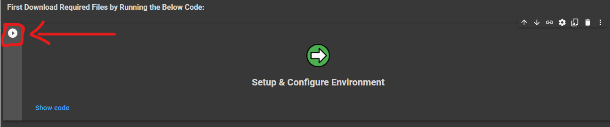
<h4><b>3.To Create/Edit/Delete/View comfig file/remote just run the code as shown in the Image.</b></h4>
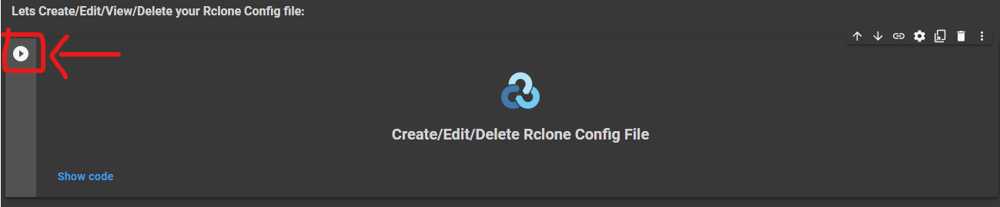
<h4><b>4.After Running the Code! Checkout the available options (shown in image) and choose a type alphabet and hit Enter key to continue, but if input filed is not visible then just click on the blinking line.</b></h4>
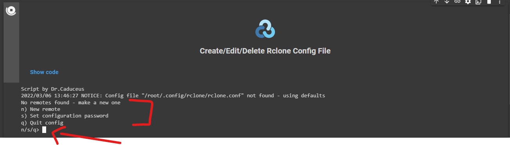
<h4><b>5.Type n and hit Enter to create a new Config file or Remote and give name, So that you can identify it in future</b></h4>
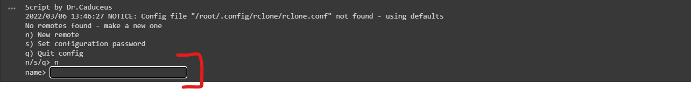
<h4><b>6.Now after Entering the name! You have to choose the cloud for which you have to make config file or remote (by typing its list number), like if you need to make config file or remote of Google Drive then type number "16" and hit Enter</b></h4>
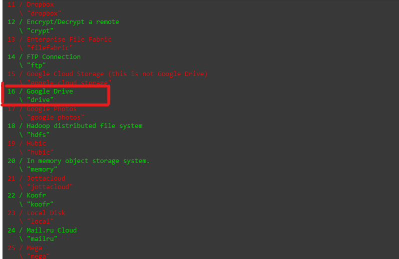
<h4><b>7.If you don't know about Client ID and Client Secret then just hit Enter without entering anything! Otherwise this can be used to bypass login into your Google Account</b></h4>
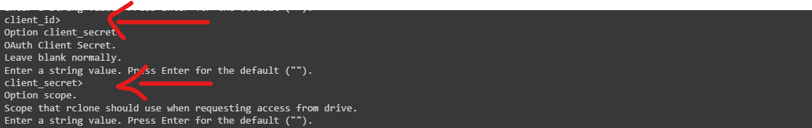
<h4><b>8.After that, It will ask you to grant which level of access to your Rclone config file, to choose it just type and hit enter the list number! I recommend to use number '1' which is for full access.</b></h4>
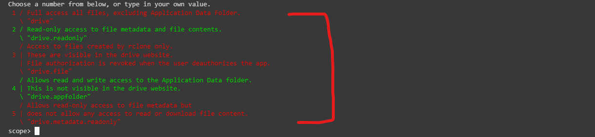
<h4><b>9.If you want to use "Computers" folder than you can provide its root_folder_id otherwise just hit Enter to ignore</b></h4>
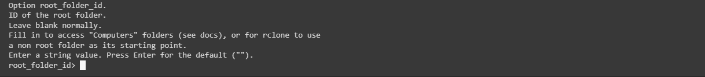
<h4><b>10.Again! If you want to use Service Accounts then you can fill the shown field otherwise leave it and hit Enter!</b></h4>
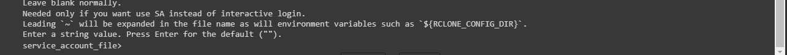
<h4><b>11.Also, for doing advanced configuration you can type y or just hit Enter to ignore it.</b></h4>
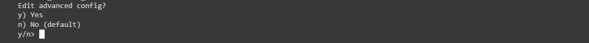
<h4><b>12.This is a important step! For Auto-Config write 'n' and hit Enter because here we are using a Remote Machine which is not our Device! So always choose 'n' otherwise login will not work.
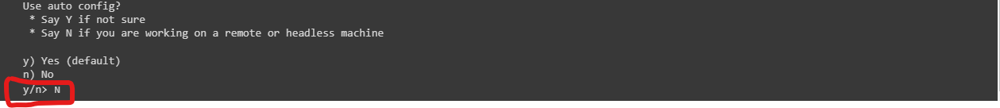
<h4><b>13.After above step! Rclone will give you an URL, You have to copy that URL and paste and open it on new tab and log in with your Google Account. After login, you will get a code just copy and paste it here as shown in the Image</b></h4>
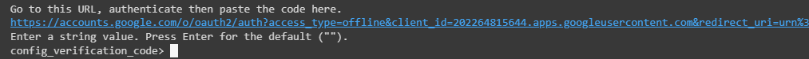
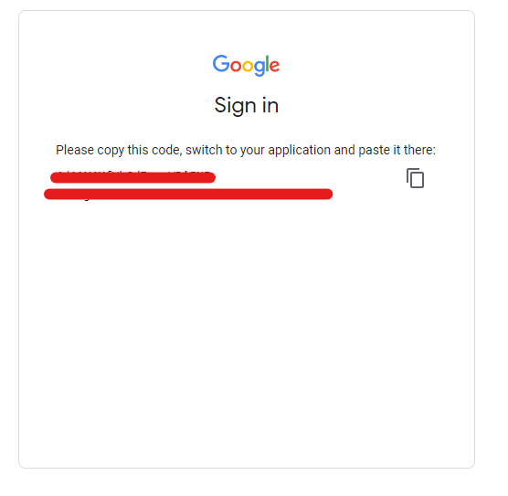
<h4><b>14.Now, it will ask you if you want to use Shared Drive or not ? y for Yes and n for No.</b></h4>
<h4><b>15.If you want to use Shared Drive then it will ask you to choose the list number of Shared Drive from the list shown (of available Shared Drive in your Account.)</b></h4>
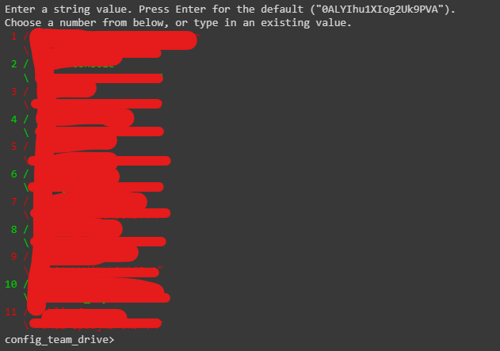
<h4><b>16.Finally! After above steps, it will show you the final code of rclone config file, you can copy paste it in any Text Editor and after that type 'y' and hit Enter to confirm and then type 'q' tp quite the configuration of file.</b></h4>
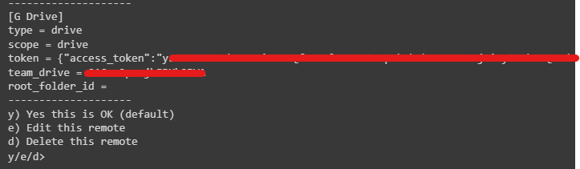
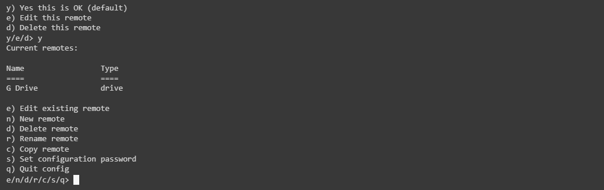
<!--- Step Area Ended --->
